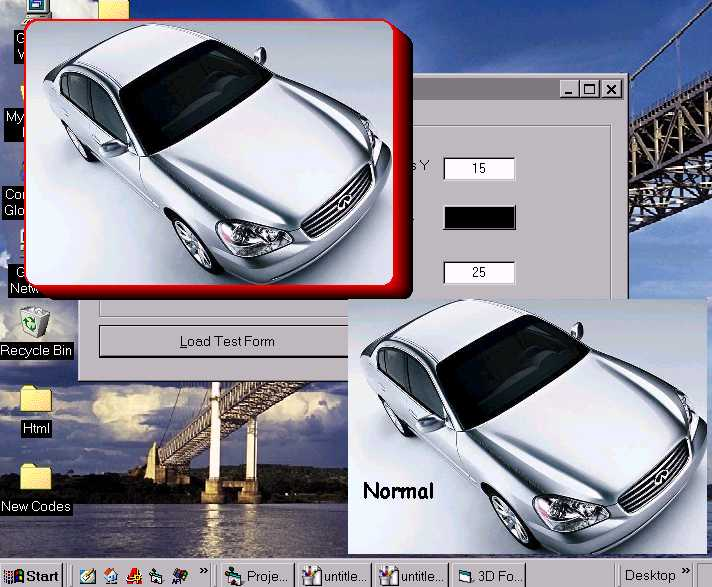



## \[ Hey\! , Look At The 3D Form  \] \- A Gradient 3D Form Making Function

### Description

All you need is a borderless form. You can convert that into a nice 3d looking one. You just need to call the function on the form load. The function is also provided with gradient effects ( see the screenshot). Enjoy! and please leave your comments.
 
### More Info
 

             |
---                |---
**Submitted On**   |2004-01-10 01:18:38
**By**             |[JJJJJJJJ](https://github.com/Planet-Source-Code/PSCIndex/blob/master/ByAuthor/jjjjjjjj.md)
**Level**          |Beginner
**User Rating**    |5.0 (35 globes from 7 users)
**Compatibility**  |VB 6\.0
**Category**       |[Graphics](https://github.com/Planet-Source-Code/PSCIndex/blob/master/ByCategory/graphics__1-46.md)
**World**          |[Visual Basic](https://github.com/Planet-Source-Code/PSCIndex/blob/master/ByWorld/visual-basic.md)
**Archive File**   |[\[\_Hey\!\_\_\_L186209372005\.zip](https://github.com/Planet-Source-Code/jjjjjjjj-hey-look-at-the-3d-form-a-gradient-3d-form-making-function__1-59363/archive/master.zip)

